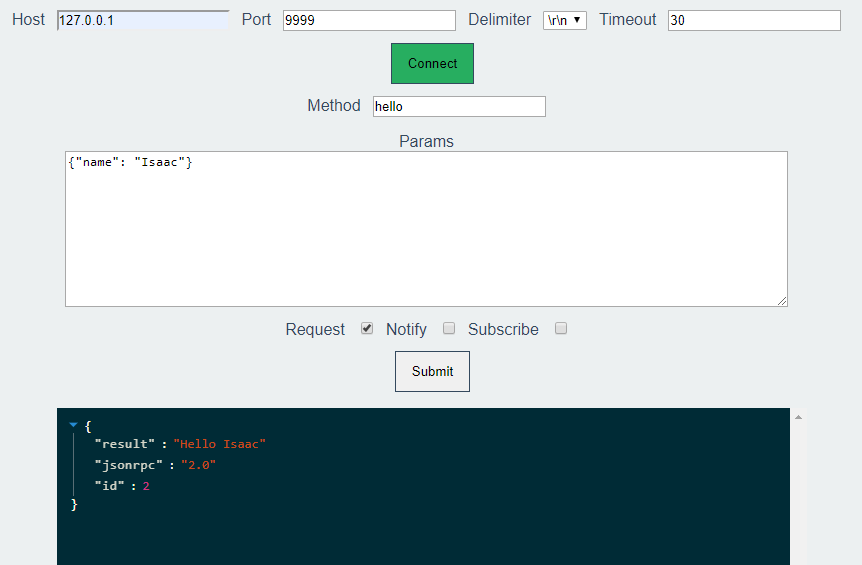
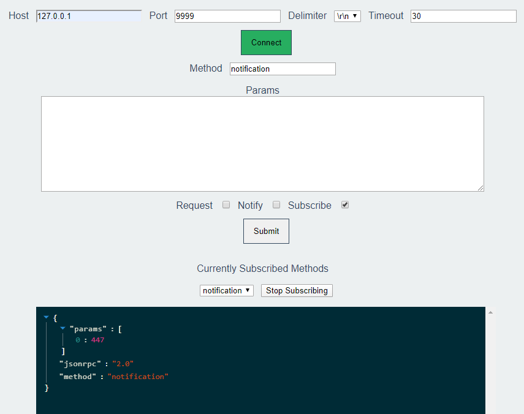

# JSON-RPC Client

A web client to interface to a JSON-RPC server over a TCP connection.

## List of features

- Send requests
- Send notifications
- Subscribe to updates

## Download and Installation

1. Download

```
git clone https://github.com/isaacgr/jsonrpc-client.git
cd jsonrpc-client/
```

2. Install the required packages and start the application

```
npm install && npm run build && npm run start
```

The server will start on `127.0.0.1:3000`.

## Interface




## Built With

- [React](https://reactjs.org/) - The web framework used
- [Jaysonic](https://github.com/isaacgr/jaysonic.git) - The library to handle the JSON-RPC communications
- [react-json-view](https://github.com/mac-s-g/react-json-view) - The interface for the responses

## Contributing

Definitely welcome. I tried to account for everything in the spec, but issues come up of course.

Keep it simple. Keep it minimal. Make sure all tests pass and no linting errors.

## Authors

- **Isaac Rowell**

## License

This project is licensed under the MIT License - see the [LICENSE](LICENSE) file for details

## Acknowledgments

Thanks to react-json-view for a cool interface to display the data in.
